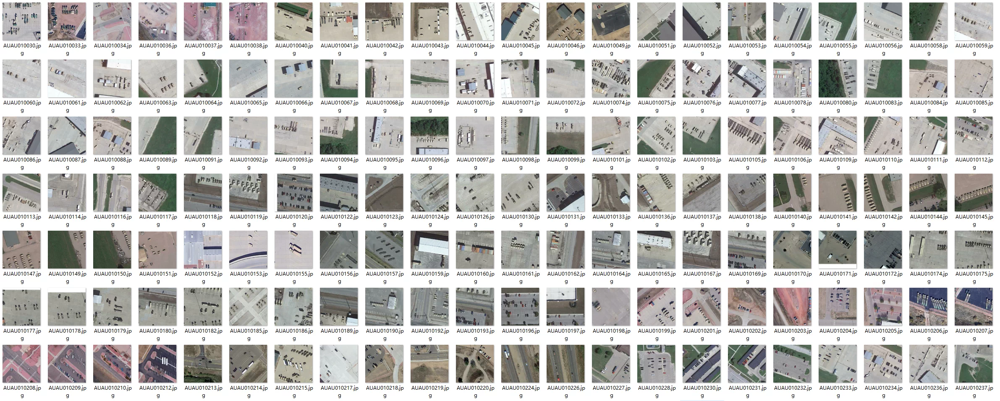
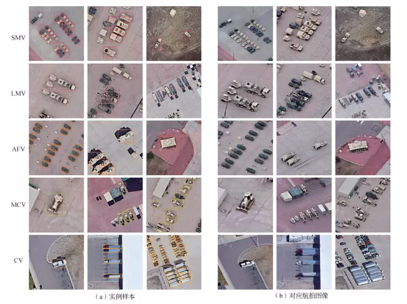
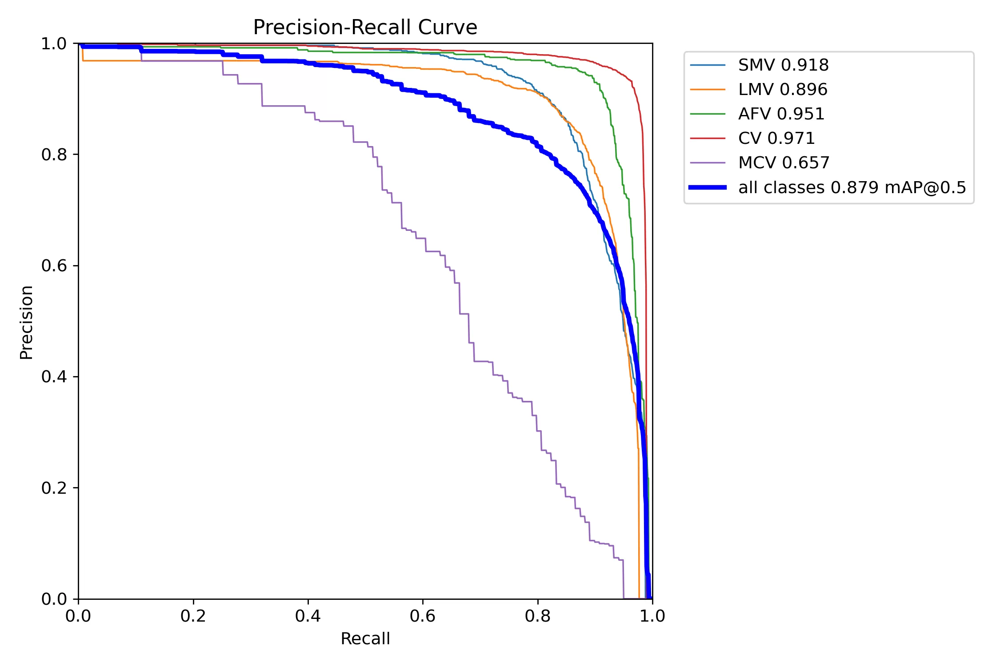
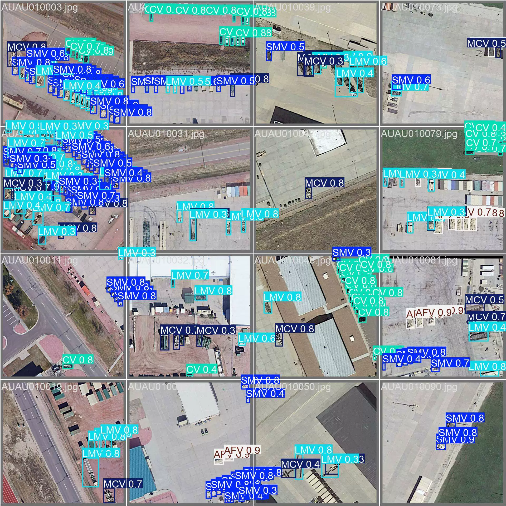
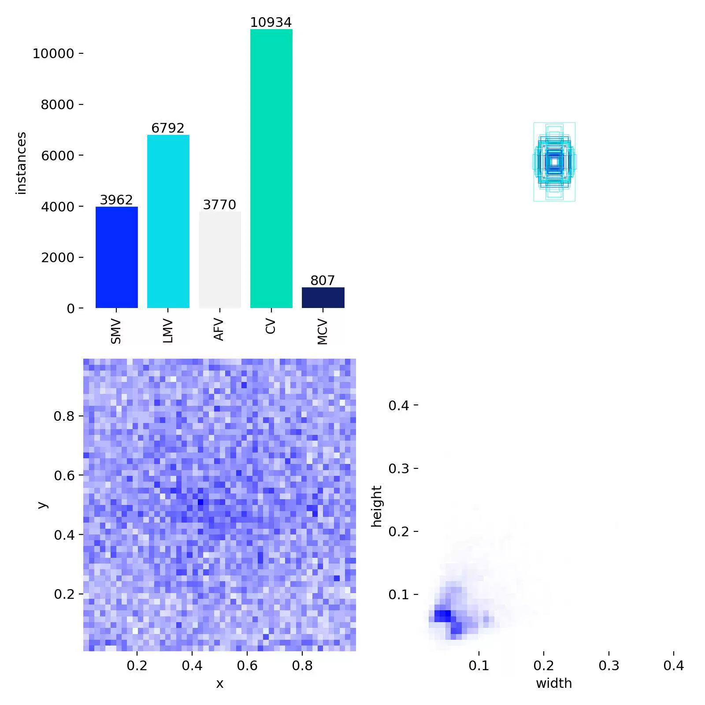

## Body

Remote Sensing Image Vehicle Detection Dataset in YOLO format

A total of 3000 images, each labeled in YOLO format, divided into training set (2392), test set (600), and validation set (8) for a total of 32626 instances.

The dataset is divided into 5 categories: SMV, LMV, AFV, CV, MCV. The meanings of these categories can be seen in the product images.

YOLOv8s weight file (Training rounds 100, pre-trained model YOLOv8s.pt, mAP@0.5 0.879) with training results files.

All contents are included in the author's articles.

Electronic virtual products sold without return or exchange.

## Images

Here is a pay link on Stripe ( https://buy.stripe.com/3cs8yP7sY87d0vu9AB ). Please contact me lonlonago@foxmail.com after funding $89, and I will send you a complete data files , thank you!

